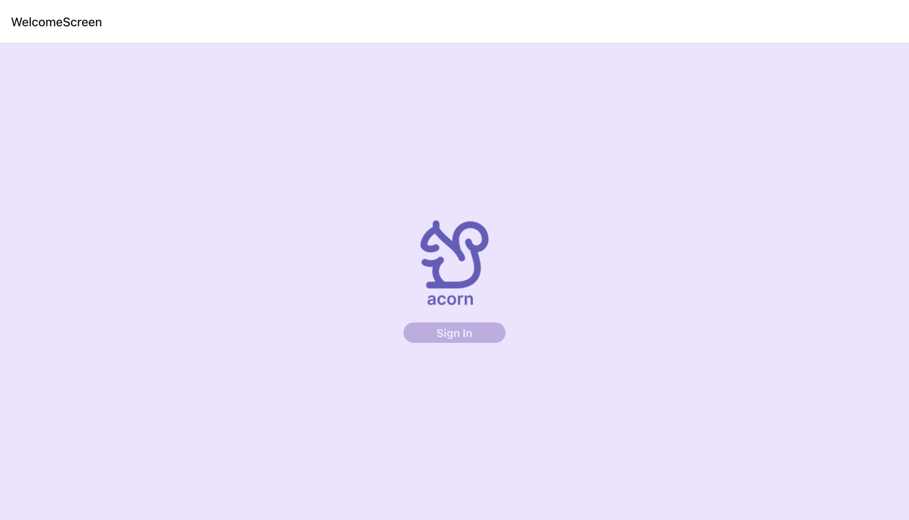
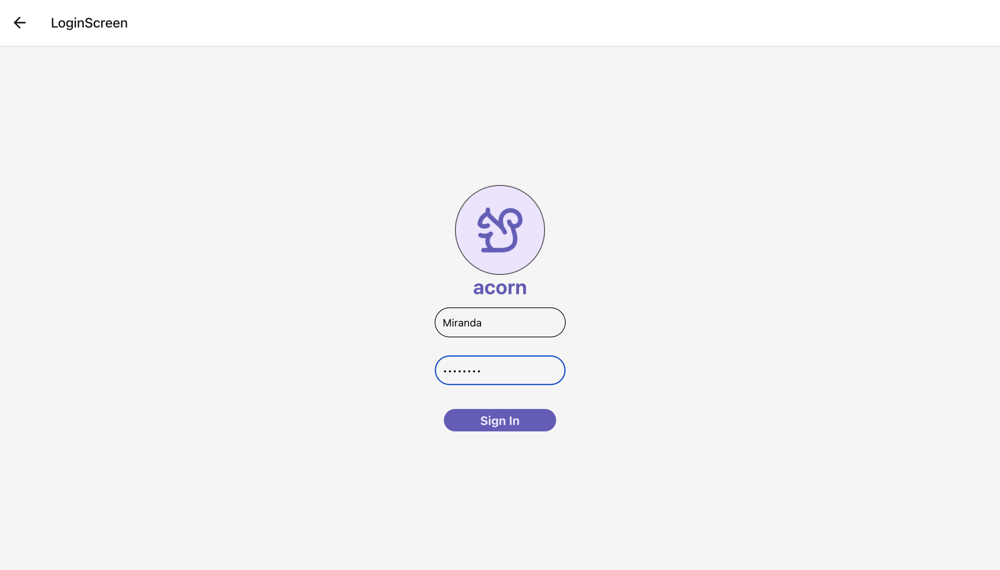
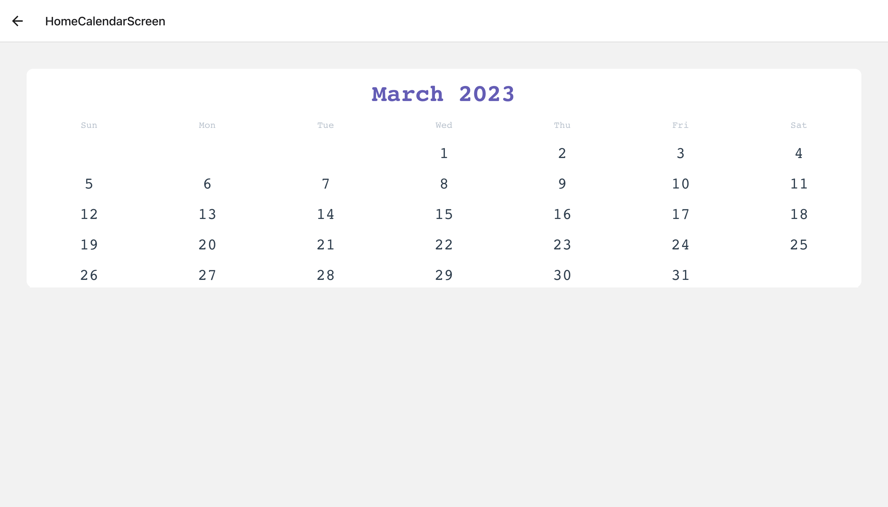
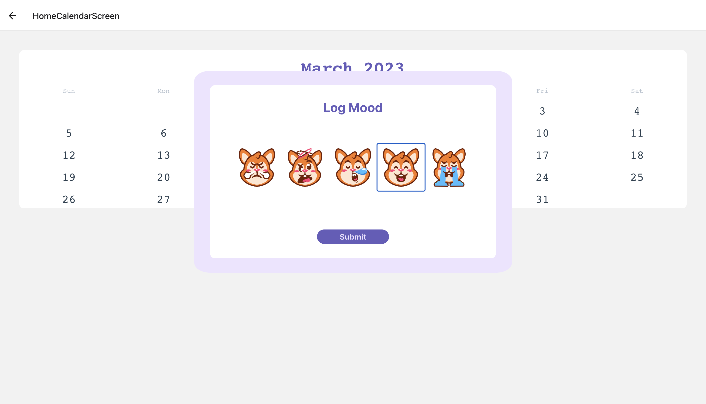

# BCS-Hacks-Acorn

## Motivation:
Our idea stems from the use of mood tracking as a positive psychology technique to support mental health. By using our app to record daily moods on a calendar, individuals can identify patterns in their emotional states and gain insight into factors that may be influencing their mood changes. With this knowledge, they can make informed decisions and take proactive steps to promote positive changes in their lives, ultimately leading to improved mental well-being.

## Technical Skills:
- React Native
- Django

## Demo Pictures:

   

   

